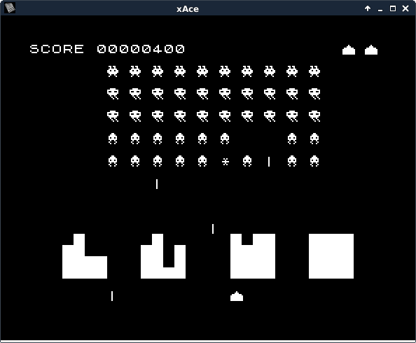

# ja-invaders

A space invaders clone for the Jupiter Ace microcomputer.

This is my attempt to rewrite a game that I orginally wrote when I was a kid.
It's a clone of a clone.

Unfortunately the game will not run on an unexpanded Ace as it weighs in at
about 5K. Forth and machine code are supposed to be fast and compact but mine,
not so much.

The only file in the repositiory needed to run
the game is forth/invaders.ja4. Many Jupiter Ace emulators allow files to be
spooled in thus simulating the act of the user typing the file content. If your
favourite emulator does not do this, then one option is to find one that does
and create a TAP file (a tape image file) that can be loaded into your emulator.
I have been using the [xAce](https://github.com/lawrencewoodman/xAce) emulator
which can spool files quickly and accurately
(using the -S option). Others I have tried have dropped characters during
the spooling process resulting in syntax errors. If you have a real Ace, then
you can recreate the full retro experience by typing the program in from the
provided listing (and I do apologise for those verbose user defined character
definitions). Once this has been done, simply use the word "play" to start the
game.

The original game was written partly in Forth and partly machine code. An
unusual design feature is that the player ship was able to move through all
pixel positions whereas the invaders moved through character positions. There
is something dishonest about having the player work in a different resolution
to the invaders but for some reason it was important to me back then and I have
to say, I do like the effect now. The original game had sound but this version
does not (mostly because xAce does not emulate sound). The original sounds (or
shall we call them beeps?) would have been short bursts as making beeps was
not a background task and would have used up precious cycles.

If you want to alter the game, be aware that the machine code routines defined
by the hex create sequences refer to the variables defined early on in the
source code and to some of the other machine code routines. So, avoid
redefining anything up to and including the machine code routines. 
Also, some of the constants are restated in the machine code so
changing these values will not be propogated to the whole code. Other than
that, changing the code after the machine code routines should be fine.

If you *really* want to alter the game, then you will want to have a
development environment that allows you to easily alter the machine code
routines, the sources for which are in the asm directory (my younger self
may have accepted the idea of hand editing machine code but that's not going
to happen today). My operating system of choice is Debian and that reflects in
the tools I have used to build the machine code sequences. I have used the
imperfect technique of using addresses ED00 upwards (but under ED40) as place
markers for variable addresses as these are not valid Z80 opcodes. The routines
in the helpers directory allow these assembly source code files to be
transformed into a format that can be added to the Forth source code and
perform the ED variable substitutions.

Finally, I have no idea what the game will run like on a real Jupiter Ace (if
at all). One crucial factor, which I doubt many emulators simulate, is the use
of what Steven Vickers refers to in the Jupiter Ace manual as back door screen
addresses. Writing to these back door addresses will be slower, on average, than
writing to normal memory as they can only be updated when they are not
being accessed by the screen refreshing circuitry. This could be overcome by
adjusting the relative timings of the various components of the game or maybe
just run it in fast mode. It seems that most remaining Aces are sitting in
collections these days so this is not a real world problem.
